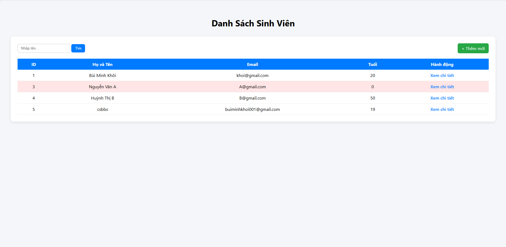
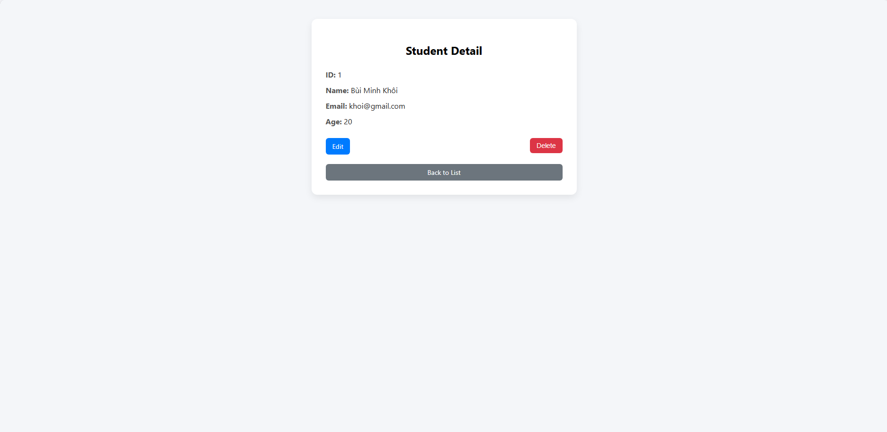
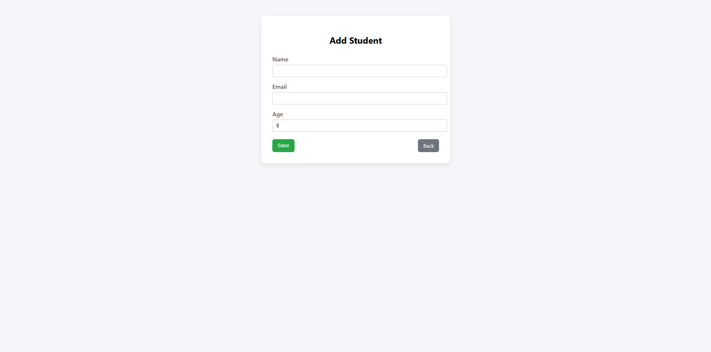
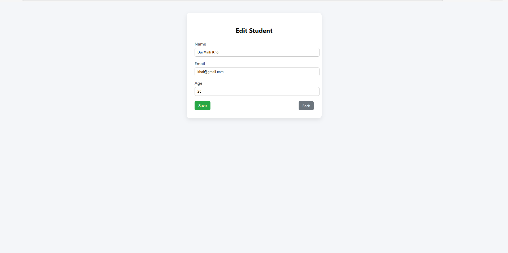

# Student Management System
## 1. Danh sách nhóm
| MSSV    | Họ và Tên       |
| ------- | --------------- |
| 2211670 | Bùi Minh Khôi   |
| 2252530 | Võ Lê Anh Nghĩa |

## 2. Public URL

Web Service đã được deploy tại: https://student-management-springboot-qaaq.onrender.com/students

## 3. Kiến trúc hệ thống

Ứng dụng được xây dựng theo mô hình **Layered Architecture**:

- Controller Layer (Presentation)
- Service Layer (Business Logic)
- Repository Layer (Data Access)
- Database Layer (PostgreSQL)

### Công nghệ sử dụng

- Java 17
- Spring Boot
- Spring Data JPA
- Thymeleaf (Server-Side Rendering)
- PostgreSQL (Neon)
- Render (Deploy Cloud)


## 4. Hướng dẫn chạy dự án (Local)

### 4.1 Clone project

```bash
git clone <repo-link>
cd student-management
```

### 4.2 Tạo file `.env`

Tạo file `.env` tại thư mục gốc project:

DATABASE_URL=jdbc:postgresql://host:port/database_name?sslmode=require
DATABASE_USERNAME=your_username
DATABASE_PASSWORD=your_password

Lưu ý:
- Không commit file `.env` lên Git.
- Mỗi thành viên tự cấu hình theo môi trường máy cá nhân.

### 4.3 Chạy ứng dụng

```bash
./mvnw spring-boot:run
```

Truy cập:

```
http://localhost:8080/students
```

# 5. Trả lời câu hỏi lý thuyết

## Lab 1
### Câu 2: Ràng buộc Khóa Chính (Primary Key)

Khi cố tình insert một sinh viên có `id` trùng với bản ghi đã tồn tại, Database báo lỗi:

```
UNIQUE constraint failed
```

Giải thích:

- `id` là Primary Key.
- Primary Key phải duy nhất.
- Database chặn thao tác để đảm bảo:
  - Không có hai bản ghi trùng khóa chính.
  - Dữ liệu không bị xung đột.
  - Đảm bảo tính toàn vẹn dữ liệu (Data Integrity).


### Câu 3: Toàn vẹn dữ liệu (Constraints)

Khi insert một sinh viên nhưng để `name = NULL`:

- Nếu không có ràng buộc `NOT NULL`, Database vẫn cho phép lưu.
- Điều này có thể gây:
  - Lỗi hiển thị ở giao diện.
  - Giá trị null trong Java.
  - Logic nghiệp vụ xử lý sai.

Bài học:

- Cần validate dữ liệu ở Service Layer.
- Nên thêm ràng buộc `NOT NULL` trong Database để đảm bảo tính chặt chẽ.

## 7. Screenshot Lab 4
### Trang Danh Sách


### Trang Chi Tiết


### Trang Thêm Sinh Viên


### Trang Chỉnh Sửa

